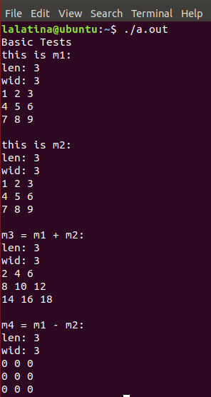
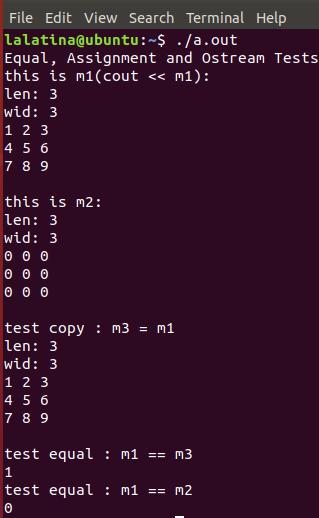
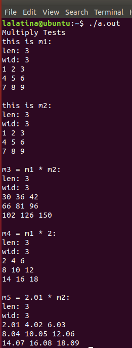

# Assignment 4: Operator Overload

## CS205 C/ C++ Program Design

###### Name: 成为

###### SID: 11712319


### Part 1. Source code

- The original code is attached in the following GitHub link：


### Part 2. Description

##### 2.1 Introduction

- In this assignment, we design a class "Matrix".

- In class Matrix, we implement operator overload for matrix operation. Operators include: **"+", "-", "*", "==", "=", "<<"**.
- ​	A serial of test in code is use to show the result
- ​	The complie system is using ***CMAKE*** and is implemented in ***ARM system - RespBerryPie***

##### 2.2 Methodology 

​	Since the project is simple, we will show how we implement and what we have done in the following part 3.


### Part 3. Implementations

##### 3.1 Matrix

- Initially we defince a class which refer to an Matrix.
- The class contains 3 ***private members***: length, width, and head address of the matrix, which desribes the property of an matrix.
- The class has ***Constructer, Deconstructer***, and other overloaded function show in the following section.
- The class contains ***getters*** to allow public space to access the members

```c++
class Matrix {
    private:    
    float ** matrix;    
    int len;    
    int wid;
    
    public:
    Matrix(int len, int wid);
    Matrix(int len, int wid, float ** matrix);
    Matrix() {}
    ~Matrix();
    
   	float **getMatrix() const;
    int getLen() const;
    int getWid() const;
    
    ...
}
```


##### 3.2 "+", "-" operators

- In this part, we implement 2 functions that allows add and substract on 2 matrix.

  ```C++
  Matrix add_matrix(const Matrix *m1, Matrix m2);
  Matrix sub_matrix(const Matrix *m1, Matrix m2);
  ```

- The function then was called by overloaded operators as:

  ```c++
  Matrix operator +(const Matrix & other) const;
  Matrix operator -(const Matrix & other) const;
  ```


##### 3.3 "=", "==", "<<" operators

- In this part, we implement 3 functions directly to meet the requirement of overload operators.

- Notice the "<<" operator should be outside the class.

  ```c++
  Matrix{
      ... 
          
      Matrix & operator =(const Matrix & other);
      bool operator ==(const Matrix & other) const;
  }
  
  ostream & operator<<(ostream & os, const Matrix & m);
  ```


##### 3.4 "*" operator

- "*" operator is overloaded with different functions.
- supports ***matrix product*** or ***number product*** of matrix.
- number could be in ***both side*** of the operator "*"

```c++
Matrix operator *(const Matrix & other) const;
Matrix operator *(const float & num) const;
friend Matrix operator*(float num, const Matrix& other);
```


### **Part 4. Result** 				

##### 4.1 Test Program logics

In following 4.2, 4.3 and 4.4, we write 3 functions to test the programming is running correctly.

The code of each test is shown below to ensure the function is an operator overloaded function.

- ###### In 4.2, we test the function of 3.2: "+", "-"

  ```c++
  void testBasicOperands(){    
      cout << "Basic Tests" << endl;    
      Matrix m1 = genTestMatrix(3,3);    
      Matrix m2 = genTestMatrix(3,3);    
      cout << "this is m1: " << endl;    
      cout << m1 << endl;    
      cout << "this is m2: " << endl;    
      cout << m2 << endl;    
      cout << "m3 = m1 + m2: " << endl;    
      Matrix m3 = m1 + m2;    
      cout << m3 << endl;    
      cout << "m4 = m1 - m2: " << endl;    
      Matrix m4 = m1 - m2;    
      cout << m4 << endl;
  }
  ```


- ###### In 4.3, we test the function of 3.3: "==", "=", "<<"

  ```c++
  void testFunctionalOperands(){    
      cout << endl;    
      cout << "Equal, Assignment and Ostream Tests" << endl;    
      Matrix m1 = genTestMatrix(3,3);    
      Matrix m2 = Matrix(3, 3);    
      cout << "this is m1(cout << m1): " << endl;    
      cout << m1 << endl;    
      cout << "this is m2: " << endl;    
      cout << m2 << endl;    
      cout << "test copy : m3 = m1 " << endl;    
      Matrix m3 = m1;    
      cout << m3 << endl;    
      cout << "test equal : m1 == m3 " << endl;    
      cout << (m1 == m3) << endl;    
      cout << "test equal : m1 == m2 " << endl;    
      cout << (m1 == m2) << endl;
  }
  ```

  

- ###### In 4.4, we test the function of 3.4: "*"

  ```c++
  void testMultiplyOperands() {
      cout << endl;    
      cout << "Multiply Tests" << endl;    
      Matrix m1 = genTestMatrix(3, 3);    
      Matrix m2 = genTestMatrix(3, 3);    
      cout << "this is m1: " << endl;    
      cout << m1 << endl;    
      cout << "this is m2: " << endl;    
      cout << m2 << endl;    
      cout << "m3 = m1 * m2: " << endl;    
      Matrix m3 = m1 * m2;    
      cout << m3 << endl;    
      cout << "m4 = m1 * 2: " << endl;    
      Matrix m4 = m1 * 2;    
      cout << m4 << endl;    
      cout << "m5 = 2.01 * m2: " << endl;    
      Matrix m5 = 2.01 * m2;    
      cout << m5 << endl;
  }
  ```


#### **Notice: All the test is running on Ubuntu@RespBerryPie**


##### 4.2 Proper result for "+", "-"



##### 4.3 Proper result for "==", "=", "<<"



##### 4.4 Proper result for "*"

