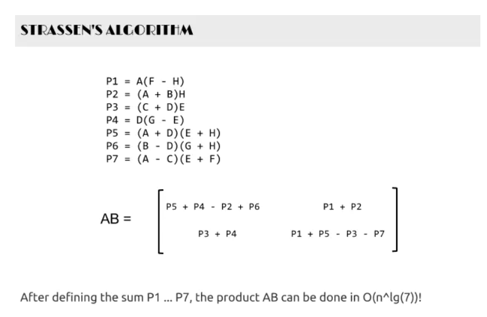
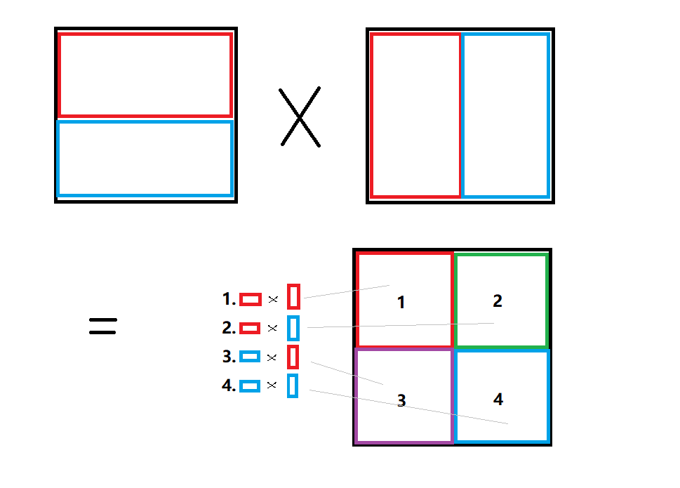
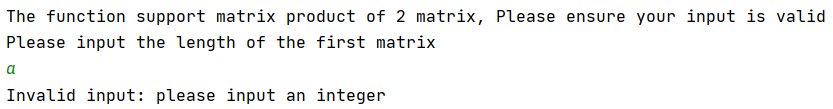
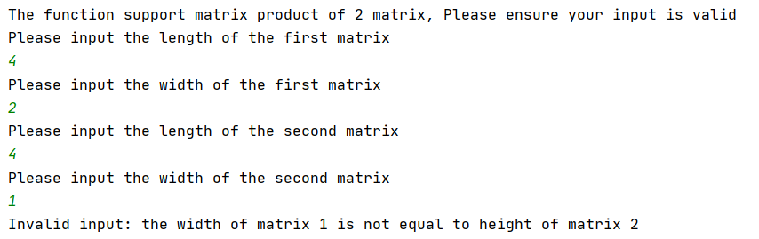
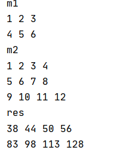
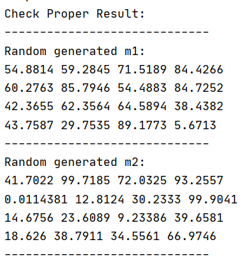
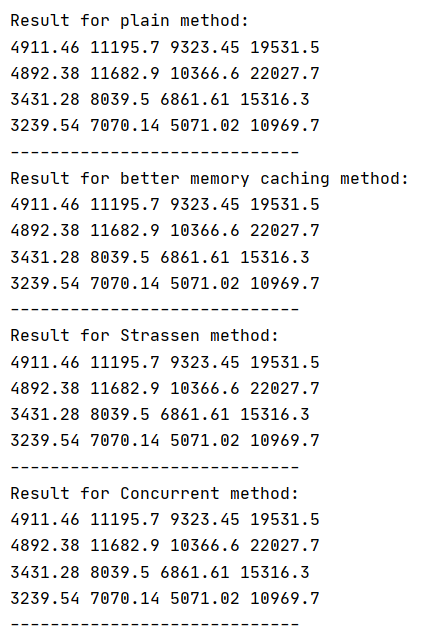
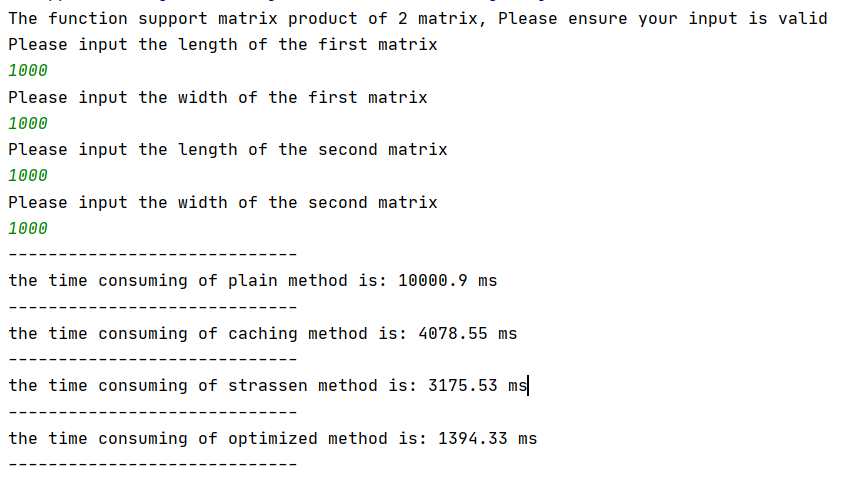
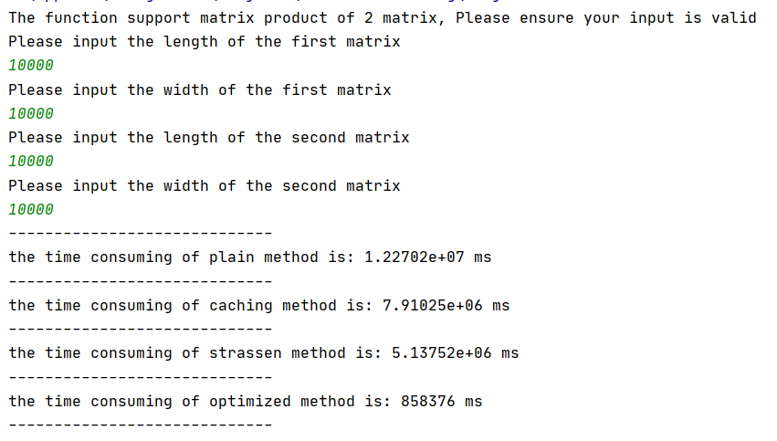

# Project 1: Matrix Multiplication

## CS205 C/ C++ Program Design

###### Name: 成为

###### SID: 11712319


### Part 1. Source code

- The original code is attached in the following GitHub link：

https://github.com/CHENGWEI-inf/CppAssignments/tree/master/Project1


### Part 2. Description

##### 2.1 Introduction

- ​	Matrix production is an essential and fatal function in computer science domain. There are uncountable usages for matrix multiplication, for example: convolution in machine learning, filtering in computer vision pre-processing, scientific calculation, etc. 
- ​	High resolution matrix production often cause enormous time consuming due to it's O(N^3) time complexity if the order of each matrix is N. Also, due to it's feature of high parallelizability and some fancy works done by pioneer mathematicians, matrix multiplication can be optimized in different angle.
- ​	It is no doubt that there are mature developing tools on matrix multiplication, however, implement one by self and try to optimize in different angle deepen the comprehension on bottom principle of high performance calculating.

##### 2.2 Methodology 

​	There are briefly 3 ways to compress the time consuming. Taking advantage of the caching mechanism(3.1), Using mathematically improve(3.2), Benefit from parallel and multiprocessor(3.3).


### Part 3. Methodology 

##### 3.1 caching mechanism 

Reference: 

> ​	http://blog.sciencenet.cn/home.php?mod=space&uid=3316223&do=blog&id=1085257

​	Before we apply this method, we should be clear that:

- In modern computer system, there are usually multiple level of caches. 
- Caching algorithm always follow the space locality.
- Cache missing waste large amount of time.

​	Hence if we change the sequence of iterations and do caching by algorithm, the speed will significant increase.

​	More details shows in the code "`optimizedMatrixProduct()`"


##### 3.2 Strassen algorithm

Reference:

> https://www.jianshu.com/p/dc67e4a3c841

​	Strassen method is a classical method, using mathematical way to alter matrix multiplication into set of matrix addition and multiplication. 

​	Due to Strassen's property, it can be only implement on square matrixes.

​	Notice the time complexity of Matrix addition is O(N^2) while multiplication is O(N^3). Thus, by applying a divide and conquer method showing by the figure below, Strassen is able to reduce the time complexity of matrix multiplication to O(N^(log7)) ( before is O(N^log(8)) ).



​	Implementation details are in "`strassen()`"

##### 3.3 Concurrent Method

​	The matrix production is highly parallelizable if we just simply do some alternation by separate the original matrix to different sub-matrixes. It is easy to prove by recursion that the result of sub matrix multiplication can be reconstruct to the big matrix multiplication. The following figure shows how we divide the matrix:



​	In this way, we can divide the matrix multiplication into 4 parallel procedure.

​	Thanks for `OpenMP` supports an interface:

​				 `#pragma omp parallel for `

​				`for loops{}`

​	We can easily implement parallel program to divide the matrix. (recursively divide and conquer is meaningless for the divide algorithm itself did not decrease the time complexity)


##### 3.4 Program running logics

In this program, we declare a struct of matrix, having member:

```c++
float ** matrix;
int len;
int wid;
```

with functions:

```c++
Matrix(int len, int wid);  
Matrix(int len, int wid, float ** matrix);
Matrix();
void printMatrix();
```


The program follows the following procedure:

1. Accept 4 input integers, describes the shape of matrix 1 and matrix 2.  Using function:

   ```c++
   void getInput(int& L1, int& W1, int& L2, int& W2, bool& err)
   ```

2. Generate random matrix content for matrix 1 and matrix 2 by constructor:

   ```c++
   Matrix(int len, int wid)
   ```

3. Do different type of multiplications. 

   ```c++
   Matrix plainMatrixProduct(Matrix m1, Matrix m2)
   Matrix optimizedMatrixProduct(Matrix m1, Matrix m2)
   Matrix concurrentMatrixProduct(Matrix m1, Matrix m2)
   Matrix strassen(Matrix mA, Matrix mB) 
   ```

4. In the best performance matrix product `concurrentMatrixProduct()`, we apply all the method contains caching and Strassen. Notice Strassen's method fails when the input is not square matrix, we use a method to check input:

   ```c++
   Matrix productOnDiffStrategy(Matrix m1, Matrix m2)
   ```

5. Verify the result and measure the metrics.

   

### **Part 4. Result** 				

##### 4.1 Robustness Test


###### Test 1: Random input




###### Test 2: Bad size for matrix multiplication


###### Test 3: Bad input integer

 


##### 4.2 Proper result verification

###### Test 1: Check valid for different size matrix 

- ​	In this test, we test by given an matrix, with **different shape**, **odd height and odd width**.
- ​	Verified the separate matrix (in **concurrent method**) works well on any circumstance 




###### Test 2: Check valid for random generated matrix

- In this test, the random generated matrix is square matrix, so that **Strassen** algorithm is tested.

  




##### 4.3 Performance metrics

###### Test 1: Performance on 1000 order matrix

- ​	The optimized result is 10 times faster than the plain method



###### Test 2: Performance on 100m matrix

- The optimized result is roughly 15 times faster than plain method

  

###### Analysis:

​	notice caching method improve less when then matrix is big, because of the line of 10000 order matrix is *39.065k*, near to *60k*, which is the size or L1 cache.  So the cache miss still happens for some times if the stack space of function is preempted by other memory (for example, code, temporary object and so on).

​	Concurrent method and Strassen has stable performance when order enlarges due to their algorithm characteristic.

​	Overall, when order is higher, the optimize effect is more obvious.