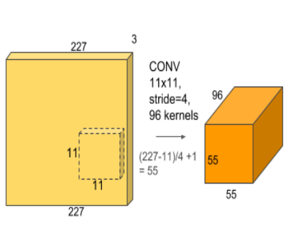
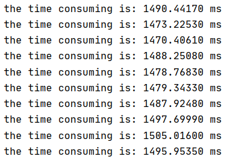
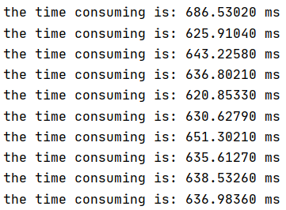
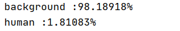
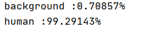
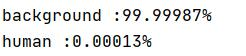
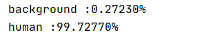

Project 2: CNN Implementation

## CS205 C/ C++ Program Design

###### Name: 成为

###### SID: 11712319


### Part 1. Source code

- The original code is attached in the following GitHub link：

  https://github.com/CHENGWEI-inf/CppAssignments/tree/master/Project2


### Part 2. Description

##### 2.1 Introduction

- ​	In this project, we need to implement an CNN  inference.

- ​    Thanks to Dr.Yu et. al, The CNN inference model is same as given model build by pytorch in the following github link:

  > https://github.com/ShiqiYu/SimpleCNNbyCPP		

  ​	In which has:

  - 3 convolution layer
  - 2 pooling layer
  - 1 full connection layer
  - Batch Normalization layer (combined to convolution layer)
  - Activate Function (ReLU)

   - ​	No back propagation is implemented, hence the CNN model can only do inference but not learning. Thus, the parameters (weights) of each kernel comes from *SimpleCNNbyCPP*.

- ​	The model is able to distinguish human from background and gives the prediction score with percentage. 

- ​     In our implementation, we start from zero to build the convolution layer, full connection layer and else functions. 

- ​     Some optimizing method is mentioned in **4.3**.

  

##### 2.2 Details

-    In this project, we take advantage of `OpenCV-4.5.1` for loading the figure. Also `OpenMP` for speeding up the program.
-    We use `PyTorch 1.6.0+cpu` for running *SimpleCNNbyCPP* and do verification.
-    The input and output size of each layer is described in **4.1**.
-    The set up of the environment is going to be described in **Part 3**
-    More implementation details are in **Part 4**
-    The Result is shown in **Part 5**


### Part 3. Set Up

##### 3.1 C++ Version

- The basic c++ version is **C++/14**
- The programming language style follows clang, and the compiler is **MSVC** in Visual Studio 2017, using architecture **amd64** (64 bit x86).
- The compile make file using **CMake**, details in `CMakeLists.txt`.


##### 3.2 OpenCV

​	with using CMake in windows/x86 system, pretend you are using MSVC in Clion, if want to build the environment, you need to:

 1. download OpenCV for windows, the install

 2. move the folder "opencv" to your MSVC lib folder. 

 3. edit environment variables.

 4. Edit your CMake list by attaching:

    ```cmake
    find_package(OpenCV REQUIRED)
    target_link_libraries(YOUR_PROJECT_NAME ${OpenCV_LIBS})  
    ```

 5. **(important)**  adjust your working dictionary in *Run Configuration*

 

​	References:

> CS205_2020_Fall_lab14.pdf,   from cpp bb website
>
> https://blog.csdn.net/adelagirl/article/details/89503715


##### 3.3 OpenMP

​	it is simple to install OpenMP, the only thing you need to do is to edit CMake list:

```cmake
FIND_PACKAGE(OpenMP REQUIRED)
if (OPENMP_FOUND)    
	message("OPENMP FOUND")
    set(CMAKE_C_FLAGS "${CMAKE_C_FLAGS} ${OpenMP_C_FLAGS}")
    set(CMAKE_CXX_FLAGS "${CMAKE_CXX_FLAGS} ${OpenMP_CXX_FLAGS}")
endif ()
```


### Part 4. Implementation


##### 4.1 model description

The model is described as: 

- The model structure: 

  -  3 channel (BGR) input, image should be originally or be down sampled (up sampled) to size of 128 * 128. 

    In another word, the input tensor should be **[3 * 128 * 128]**.

  - The first layer is a **convolution** layer with kernel size = 3 * 3, stride = 2 and padding = 1.

    The output tensor should be **[16 * 64 * 64]**.

  - The second layer is a **max pooling** layer with stride = 2 and kernel size = 2 * 2.

    The output tensor should be **[16 * 32 * 32]**.

  - The third layer is a **convolution** layer with kernel size = 3 * 3, stride = 1 and padding = 1.

    The output tensor should be **[32 * 30 * 30]**.

  - The forth layer is a **max pooling** layer with stride = 2 and kernel size = 2 * 2.

    The output tensor should be **[32 * 15 * 15]**.

  - The fifth layer is a **convolution** layer with kernel size = 3 * 3, stride = 2 and padding = 1.

    The output tensor should be **[32 * 8 * 8]**.

  - The sixth layer is a **full connection** layer with kernel size = 2048 * 2

    The output tensor should be **[2]**.

- A ReLU Activate function is connected after each step (layer 2, 4, 5).

- A Softmax is calculated in the end for describing the feature by normalizing it into 0 to 1.


##### 4.2 Architechture and Implements

- The files structure is divided into 3 parts: `head/`, `source/`, `param/`.

- There are `face_binary_cls.cpp` and `face_binary_cls.h` in `param/`, which defines parameter and stores parameter, including size, weight, bias and so on:

```c++
typedef struct conv_param {
    int pad;
    int stride;
    int kernel_size;
    int in_channels;
    int out_channels;
    float* p_weight;
    float* p_bias;
} conv_param;
typedef struct fc_param {
    int in_features;
    int out_features;
    float* p_weight;
    float* p_bias;
} fc_param;
extern float conv0_weight[16*3*3*3];
extern float conv0_bias[16];
extern float conv1_weight[32*16*3*3];
extern float conv1_bias[32];
extern float conv2_weight[32*32*3*3];
extern float conv2_bias[32];
extern float fc0_weight[2*2048];
extern float fc0_bias[2];
extern conv_param conv_params[3];
extern fc_param fc_params[1];
```


- The main part of the function is store in `head/` and `source/`, the detailed is followed:	

  - `ImageReader`, reads image and cast it to RGB tensor

  ```c++
  ImageReader(const string &imgPath);
  float * toRGBTensor();
  ```

  - `Conv2D`, derives a 2D convolution algorithm. Also gives the flatten and reverse flatten function. 

  ```c++
  float convByWindow(float ** window, float ** kernel, int size);
  float ** conv2D(const float * input_tensor1D, float ** kernel2D, int stride, int pad, int input_size, int kernel_size);
  float * toTensor(float ** img2D, int img_size);
  float ** toMatrix(const float * tensor, int size);
  ```

  - `ConvLayer`, `FullConnection`, `MaxPool`, gives the each layer function

  ```c++
  class ConvLayer {
      private:    
      conv_param convParam{};    
      int input_size;
      float * input_tensor; // [in_channels, width, length]
      float * output_tensor;
      public:
      void doConvolution();
      ......
  }
  
  float * maxPooling(float * input_tensor, int input_size, int kernel_size, int stride, int channels, int& output_size);
  ......
  
  float *fullConnection(float *input_tensor, fc_param fcParam);
  ......
      
  ```

  - `ActivateFunction`, `SoftMax` supports some useful function in convolution.

  ```c++
  void ReLU(float *tensor, int size);
  void softMax(float * features, int n)
  ```

  with ReLU follows equation:
  $$
  ReLU(tensor) = \begin{cases} tensor[i]，tensor[i] > 0\\ 0\quad\quad\quad， tensor[i] <= 0\end{cases}
  $$
  and SoftMax follows equation:
  $$
  S(i) = \frac{e^i}{	\sum_{j=1}^{n} e^j}
  $$
  

  - `Model` combines the entire model. returns the features.

  ```c++
  float * run_model(float * rgbTensor, int img_size);
  ```

  

- The `doConvolution()` method follows the basic methodology of matrix convolution with:

  - add **bias** after convolution for each channel
  - support **arbitrary stride and padding**
  - output size derived by the following equation:

  $$
  output size = (input size - kernel size + 2 * pad) / stride + 1;
  $$

  - combine the input channels to 1 channel by addition.
  - detailed convolution rule: reference to *AlexNet*:

  


##### 4.3 Optimization 

###### 4.3.1 flattened tensor 

​	In our model, we set the data between each module and layer to be flattened, which means is 1D tensor.  for example:

```c++
float * out0 = conv0.getOutputTensor();
float * pool0 = maxPooling(out0,...);
ReLU(pool0, ...);
```

The apply of flattened tensor ensures:

	1. We don't need to addressing the target data with hierarchical querying, which speeds up the addressing process. 
 	2. the memory in 1D tensor is continuous allocated, which means cache miss is reduced when iteratively access the data.
 	3. each time we recycle the memory, we only need to use `delete []` instead of iteratively deletion, avoid the possibility of memory leaking.


###### 4.3.2 parallel

​	In over convolution layer, we use OpenMP to parallel the convolution for each output channel. 

```c++
#pragma omp parallel for    
for(int i = 0; i < convParam.out_channels; i++){
    ...
}
```

​	This parallel brings total performance increasing. We calculate the time of executing the entire model.

   With original time consuming: 



​	average =  640.638 ms

and optimized time consuming:



​	average =  1486.703 ms

​	The average speed up is  **43.09 %** calculate by:
$$
speedUp = \frac{\sum_{i=1}^{n} original Time(n) - \sum_{i=1}^{n} optimized Time(n)}{\sum_{i=1}^{n} original Time(n))} - 1
$$
​    

### Part 5. Verification

In this part, it will show 2 official test cases with test result and 1 test case from the network. It is only use for verify the correctness of the CNN inference.


###### background : bg.png





###### face: face.jpg





###### Shen Zhen Harbor





###### MAO





### Part 6. References

> https://github.com/ShiqiYu/SimpleCNNbyCPP
>
> 《机器学习》 周志华
>
> https://blog.csdn.net/adelagirl/article/details/89503715
>
> https://blog.csdn.net/varyshare/article/details/94162064
>
> https://blog.csdn.net/program_developer/article/details/80943707